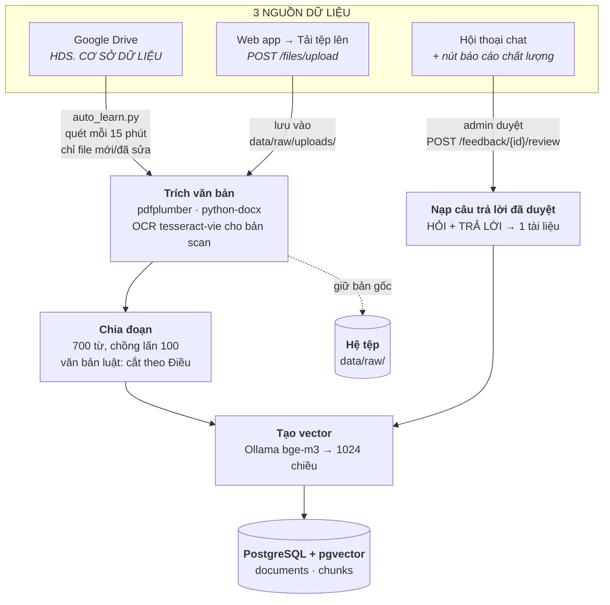
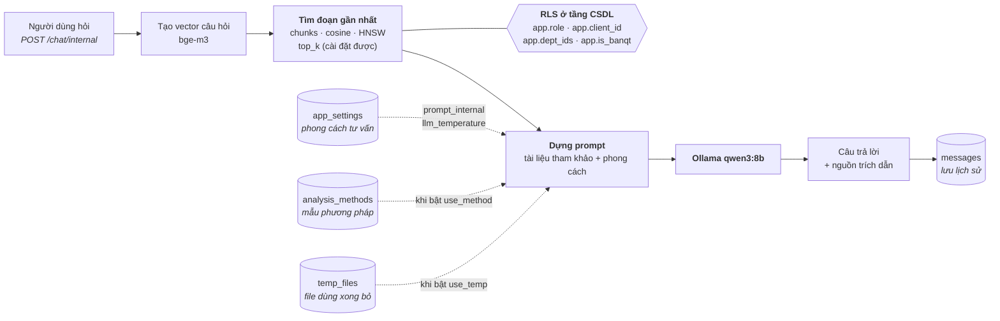
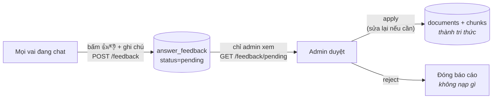

# Dữ liệu AI nằm ở đâu trên máy chủ

Ba nơi lưu, mỗi nơi một vai trò. Hiểu đúng ba chỗ này là biết cần sao lưu gì, xoá gì
khi hết chỗ, và mất gì nếu ổ cứng hỏng.

| Nơi lưu | Đường dẫn | Chứa gì | Sao lưu? |
|---|---|---|---|
| **Hệ tệp** | `hds-ai/data/raw/` | Bản gốc mọi tài liệu (từ Drive + web tải lên) | Có — hoặc dựa vào Drive |
| **PostgreSQL** | Docker volume `pgdata` | Vector, nhãn, hội thoại, cài đặt, phân quyền | **BẮT BUỘC** |
| **Ollama** | `/usr/share/ollama/.ollama/models` | Mô hình `qwen3:8b`, `bge-m3` | Không — tải lại được |

---

## 1. Luồng nạp dữ liệu vào bộ nhớ AI



**Điểm cần nhớ:** bản gốc tệp ở hệ tệp, còn *tri thức* mà AI dùng để trả lời nằm ở
bảng `chunks` trong PostgreSQL. Xoá `data/raw/` thì AI **vẫn trả lời được** (chỉ mất
chức năng tải bản gốc về). Mất PostgreSQL là **mất toàn bộ tri thức**.

---

## 2. Luồng trả lời một câu hỏi



**RLS (Row-Level Security) là chốt an toàn thật.** Câu lệnh tìm kiếm **không** có điều kiện
lọc quyền — chính CSDL từ chối trả về đoạn mà người hỏi không được xem. Dù code ứng dụng
có lỗi, khách A vẫn không thấy hồ sơ khách B.

---

## 3. Vòng tự học từ hội thoại



Người dùng thường **không** có quyền nạp gì vào bộ nhớ AI — họ chỉ báo cáo. Mọi thứ vào
tri thức đều qua tay admin. Đây là chỗ chất lượng bot tăng dần theo thời gian.

---

## 4. Chi tiết bảng trong PostgreSQL

| Nhóm | Bảng | Vai trò |
|---|---|---|
| **Tri thức** | `documents` | 1 dòng / tài liệu: tiêu đề, loại, mức truy cập, chủ sở hữu, tóm tắt |
| | `chunks` | Đoạn văn bản + **vector 1024 chiều** — thứ AI thật sự dùng để trả lời |
| | `document_versions` | Lịch sử sửa nội dung tài liệu |
| **Hội thoại** | `conversations`, `messages` | Lịch sử chat, nguồn trích dẫn, độ trễ |
| | `answer_feedback` | Báo cáo chất lượng của người dùng |
| | `temp_files` | File "dùng xong bỏ" — tự xoá sau 6 giờ |
| **Nghiệp vụ** | `clients`, `matters`, `client_profiles` | Khách hàng, vụ việc, hồ sơ 360° |
| | `analysis_methods` | Mẫu phương pháp phân tích (dạy AI cách làm) |
| **Phân quyền** | `users`, `departments`, `user_departments` | Người dùng, phòng ban, một người nhiều phòng |
| | `access_rules` | Ma trận quyền: loại tài liệu × cấp × phòng |
| **Hệ thống** | `app_settings` | Phong cách tư vấn, bản đồ thư mục Drive, tham số AI |
| | `audit_log` | Nhật ký mọi thao tác — không sửa/xoá được |

---

## 5. Sao lưu

Chỉ **PostgreSQL** là không thể tạo lại. Tài liệu gốc còn trên Drive, mô hình tải lại được.

```bash
# Sao lưu (đặt lịch cron hằng đêm)
docker exec hds-postgres pg_dump -U hds -Fc hdsai > ~/backup/hdsai_$(date +%F).dump
```

```bash
# Phục hồi
docker exec -i hds-postgres pg_restore -U hds -d hdsai --clean --if-exists < backup.dump
```

> Bản dump **chứa toàn bộ hồ sơ khách hàng**. Đặt ở thư mục quyền 700, không đưa lên
> GitHub (`.gitignore` đã chặn `*.dump`), và cân nhắc mã hoá nếu chép ra ổ ngoài.

**Hết chỗ đĩa?** Xoá được: `data/work/` (file tạm), `data/raw/` (nếu Drive vẫn còn bản gốc —
nhưng sẽ mất chức năng tải về). **Không bao giờ** xoá volume `pgdata`.
